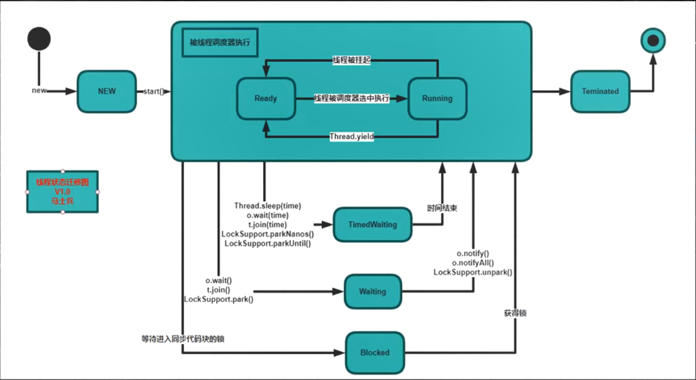

# 单机高并发应该掌握的线程基础：线程状态，异常与锁等

## 什么是线程

进程：操作系统资源分配的基本单位<br>
线程：进程的最小执行单元

## 线程实现

>启动线程的三种方式：
>继承Thread、实现 Runnable、通过线程池 Executors.newCachedThread

```java
public class HowToCreateThread {

    private static class T1 extends Thread {
        @Override
        public void run() {
            System.out.println("T1 = " + Thread.currentThread().getName());
        }
    }

    private static class T2 implements Runnable {
        @Override
        public void run() {
            System.out.println("T2 = " + Thread.currentThread().getName());
        }
    }

    public static void main(String[] args) {
        T1 t1 = new T1();
        t1.start();

        Thread t2 = new Thread(new T2());
        t2.start();

        Thread t3 = new Thread(() -> {
            System.out.println("T3 = " + Thread.currentThread().getName());
        });
        t3.start();

        ExecutorService executorService = Executors.newCachedThreadPool();
        executorService.execute(() -> {
            System.out.println("T4 = " + Thread.currentThread().getName());
        });
        executorService.shutdown();
    }
}
```

## 常用方法

>常用方法：sleep yield join

- sleep
  - 当前线程暂停，让给别的线程
  - 等待指定时间后自动复活
  - sleep完，也是回到就绪状态
- yield
  - 回到等待队列（让出一下CPU）
  - 返回就绪状态（Running->Ready）
- join
  - 加入其它线程
  - t1线程调用t2.join() t1->t2.join->t1->end
  - 常用来等待其它线程结束

## 线程状态



- New 创建线程，还没调用start()方法
- Runnable 调用start()方法后（被线程调度器执行）
  - Ready 就绪状态（在CPU等待队列）
  - Running 运行状态（真正的在CPU上运行）
- Timed_Waiting
- Waiting
- Blocked 加上同步代码块synchronized，没得到锁
- Terminated 执行结束进入该状态，不能再调用start()

## 线程同步

## synchronized关键字

- 锁的是对象不是代码
- 对象方法 <=> synchronized(this) 
- 静态方法 <=> synchronized(T.class)

```java
public class FineCoarseLock {
    //等同于在方法的代码执行时要synchronized(this)
    public synchronized void lockThis() {
        System.out.println("FineCoarseLock = " + Thread.currentThread().getName());
    }

    //这里等同于synchronized(FineCoarseLock.class)
    public synchronized static void lockStatic() {
        System.out.println("FineCoarseLock = " + Thread.currentThread().getName());
    }
}
```

- synchronized同时保证了原子性和可见性
- 不能用String常量、Integer、Long(池化)

### 同步方法与非同步方法

- 锁定方法（同步） 非锁定方法（非同步） 可以同时执行

### 可重入

- 一个同步方法可以调用另外一个同步方法，一个线程已经拥有某个对象的锁，再次申请的时候仍然会得到该对象的锁.
- 也就是说synchronized获得的锁是可重入的
- 这里是继承中有可能发生的情形，子类调用父类的同步方法

### 异常与锁

- 程序在执行过程中，如果出现异常，默认情况锁会被释放

### 锁升级

- 无锁—>偏向锁->自旋锁->重量级锁
- 没有降级？

### synchronized的底层实现

- JDK早期的 重量级 - OS
  - 后来的改进，锁升级的概念：
     - [没错，我就是厕所所长！(一)](https://mp.weixin.qq.com/s/Fep24OWHeck5O-sgILi39Q)
     - [没错，我就是厕所所长！(二)](https://mp.weixin.qq.com/s/-LWdHdLzEvAOlffMaWcXqQ)
    
- 锁升级 sync(Object)
  - markword 记录这个线程ID (偏向锁)
  - 如果线程争用：升级为 (自旋锁)
  - 10次以后，升级为 (重量级锁) - OS

- 锁的使用
  - 执行时间短（加锁代码），线程数少，用自旋
  - 执行时间长，线程数多，重量级锁

- 自旋锁 用户态 占用CPU时间 不访问操作系统
- 系统锁 访问操作系统(经过OS)，进入等待队列，不占CPU

