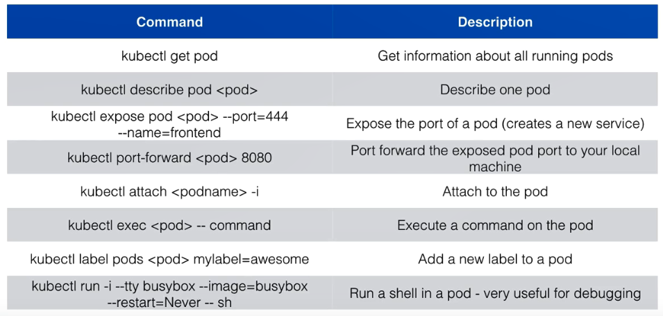

# Commands

## minikube

## kubectl



```sh
# 将本地 docker 与 K8S 依赖的 docker 进行绑定
eval $(minikube docker-env)
# 取消与 minikube 中的 docker 进行绑定
eval $(minikube docker-env -u)


docker save -o /opt/package/docker/image/fobgochod-admin.tar fobgochod/fobgochod-admin:1.0.0
docker load -i /opt/package/docker/image/fobgochod-admin.tar

docker save -o /opt/package/docker/image/fobgochod-admin-ui.tar fobgochod/fobgochod-admin-ui:1.0.0
docker load -i /opt/package/docker/image/fobgochod-admin-ui.tar

kubectl exec -it {podName} /bin/bash
```

