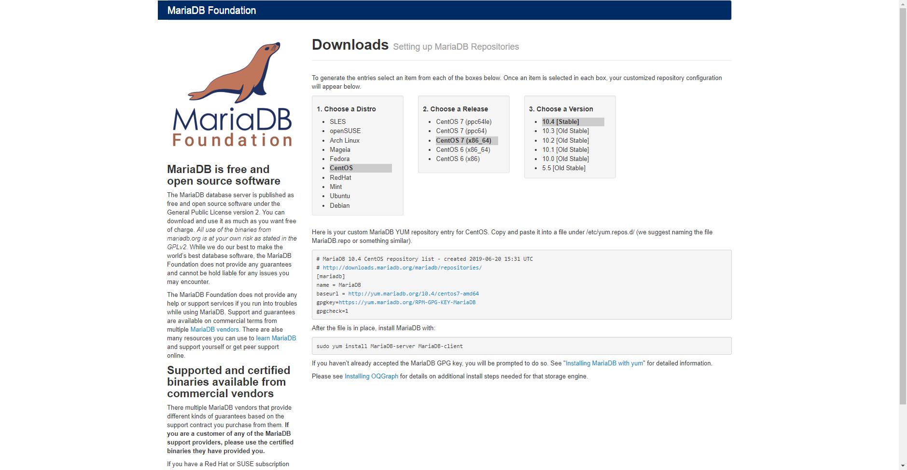

# Install

## 文档

[https://downloads.mariadb.org/mariadb/repositories](https://downloads.mariadb.org/mariadb/repositories)

```sh
# 查看系统发型版本
yum install redhat-lsb -y
lsb_release -a
```



```sh
vi /etc/yum.repos.d/MariaDB.repo
```

```sh
# MariaDB 10.5 CentOS repository list - created 2021-04-08 17:12 UTC
# http://downloads.mariadb.org/mariadb/repositories/
[mariadb]
name = MariaDB
baseurl = http://yum.mariadb.org/10.5/centos7-amd64
gpgkey=https://yum.mariadb.org/RPM-GPG-KEY-MariaDB
gpgcheck=1
```

```sh
# 中国科学技术大学
[mariadb]
name = MariaDB
baseurl = http://mirrors.ustc.edu.cn/mariadb/yum/10.2/centos7-amd64
gpgkey=http://mirrors.ustc.edu.cn/mariadb/yum/RPM-GPG-KEY-MariaDB
gpgcheck=1

# 清华大学开源软件镜像站
[mariadb]
name = MariaDB
baseurl = https://mirrors.tuna.tsinghua.edu.cn/mariadb/yum/10.4/centos7-amd64
gpgkey=https://mirrors.tuna.tsinghua.edu.cn/mariadb/yum/RPM-GPG-KEY-MariaDB
gpgcheck=1
```

```sh
sudo yum install MariaDB-server MariaDB-client
```

## 配置

```sh
# 启动
systemctl start mariadb
# 开机启动
systemctl enable mariadb
# 重启
systemctl restart mariadb
service mysqld restart
```

```shell
mysql_secure_installation

# 首先是设置密码，会提示先输入密码
Enter current password for root (enter for none):<–初次运行直接回车

# 设置密码
Set root password? [Y/n] <– 是否设置root用户密码，输入y并回车或直接回车
New password: <– 设置root用户的密码
Re-enter new password: <– 再输入一次你设置的密码


# 其他配置
Remove anonymous users? [Y/n] <– 是否删除匿名用户，回车
Disallow root login remotely? [Y/n] <–是否禁止root远程登录,回车,
Remove test database and access to it? [Y/n] <– 是否删除test数据库，回车
Reload privilege tables now? [Y/n] <– 是否重新加载权限表，回车
```

### 配置字符集
```shell
#文件/etc/my.cnf
vi /etc/my.cnf
#在[mysqld]标签下添加
init_connect='SET collation_connection=utf8_general_ci'
init_connect='SET NAMES utf8' 
character-set-server=utf8
collation-server=utf8_general_ci
skip-character-set-client-handshake
lower_case_table_names=1
#文件/etc/my.cnf.d/client.cnf
vi /etc/my.cnf.d/client.cnf
#在[client]中添加
default-character-set=utf8
#文件/etc/my.cnf.d/mysql-clients.cnf
vi /etc/my.cnf.d/mysql-clients.cnf
#在[mysql]中添加
default-character-set=utf8
```

# 授予外网登陆权限
```shell
# 登陆mysql
mysql -uroot -proot
# 授权
MariaDB [mysql]> grant all privileges on *.* to root@'%' identified by 'root'; 
MariaDB [mysql]> flush privileges;
```